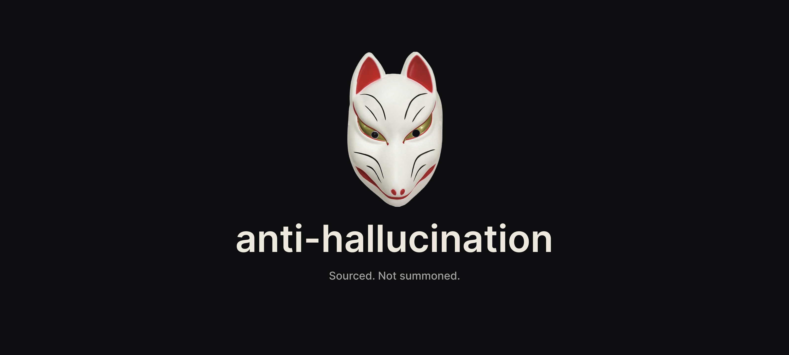

<p align="center">
  
</p>

<p align="center">
  A Claude Code skill that catches ungrounded factual claims before they ship, and grades how often they slip through.
</p>

<p align="center">
  
  
</p>

<p align="center">
  <a href="SKILL.md">SKILL.md</a>
  &nbsp;·&nbsp;
  <a href="docs/design.md">Design notes</a>
</p>

<p align="center">
  Built by <a href="https://github.com/rbwilson">Ryan Wilson</a>
</p>

---

## The problem

Modern LLMs are trained to sound confident. The result is a measurable failure pattern: Claude asserts a file path that doesn't exist, cites a statistic that doesn't match the data, summarizes a multi-row DB result in a way that subtly changes the answer. These aren't bugs; they're the default behavior when verification is optional.

The fix isn't "verify everything." That's paralysis. The fix is **verify or hedge, never assert from memory.** Run the check when verification is easy. Tag the staleness when relying on memory. Say "I'd need to check X" when the answer requires a check you haven't run.

This skill catches four specific hallucination patterns before they ship, and provides an on-demand audit to grade how often Claude grounded its claims.

---

## The four patterns

1. **Fabrication.** Asserting a file, function, symbol, path, citation, or paper exists without a Read/Grep/lookup result this session.

2. **Stale recall.** Asserting a remembered value (count, statistic, status, config, version) as current truth, without re-verification or explicit freshness tagging.

3. **Tool-output paraphrase drift.** Restating tool output in a way that subtly changes the value, count, direction, or scope. Most often happens when summarizing across multiple rows.

4. **Unhedged confidence on uncertain claims.** Definitive factual or numerical statements with no verification artifact in the turn: "this function returns X" without grep/read, "the table has N rows" without a count query.

Each pattern has a clear trigger, a clear "not this" case, and a tell. Full definitions in [SKILL.md](SKILL.md).

---

## What the skill does

Two modes.

**Silent self-check.** Runs before substantive responses: claims about code/data/state, recommendations, reversals, completion reports. Four trigger questions plus a closing calibration. The user sees a normal response filtered through the heuristic. No ritual phrases.

**On-demand audit (`/hallucination-check`).** Grades each of the four patterns CLEAN/YELLOW/RED with verbatim transcript quotes and named missing verification artifacts. Self-corrections (assert then verify in the same turn) grade CLEAN, not YELLOW.

The audit identifies missing verification but does not re-run the missing checks. That distinction matters: the skill is a metacognitive guardrail, not a workflow tool.

---

## Red-team suite

The skill ships with a structured red-team test suite in [`redteam/`](redteam/). 14 cases cover all four patterns plus evasion probes (confidence laundering, buried fabrication, surface-level hedging) and clean baselines. Each case is a seeded transcript with expected grades and verbatim quote targets — paste into a fresh session, run `/hallucination-check`, compare output.

The suite measures recall per pattern and false positive rate on clean sessions. See [`redteam/README.md`](redteam/README.md) for protocol and the scorecard template.

The skill has been red-teamed twice against this suite (claude-sonnet-4-6). Run 1 identified three gaps in the silent self-check — a multi-symbol fabrication gate, a cross-turn stale-recall gate, and a summary-before-overclaim gate. All three were added to SKILL.md. Run 2 confirmed 14/14 PASS with no regressions on clean baselines. Results: [`redteam/results-2026-05-20.md`](redteam/results-2026-05-20.md) · [`redteam/results-2026-05-20-run2.md`](redteam/results-2026-05-20-run2.md)

---

## Install

```bash
git clone https://github.com/Telos-evals/anti-hallucination
cd anti-hallucination
./install.sh
```

Then optionally append this to `~/.claude/CLAUDE.md` to enable the always-on silent self-check:

```
Before substantive responses (claims about code/data/state, recommendations,
reversals of prior positions, completion reports), run the anti-hallucination
self-check from ~/.claude/skills/anti-hallucination/SKILL.md.
```

Without the CLAUDE.md snippet, the audit still works via `/hallucination-check`. The silent self-check requires the snippet because Claude needs an explicit instruction to run it on every substantive turn.

---

## Family

Part of the calibration skill family. The whole suite shares one identity: a *hyakki yagyō*, a night parade of cognitive failure modes, one yōkai per skill.

- [anti-sycophancy](https://github.com/Telos-evals/anti-sycophancy): the **Hannya**, the mask of consuming distortion. Catches sycophancy patterns (capitulation, false success, hedging, praise/framing-mirror).
- **anti-hallucination** (this repo): the **kitsune-bi**, foxfire that convinces with no source behind it. Catches ungrounded factual claims.
- anti-dependency *(planned)*: the **Jorōgumo**, the spider-woman who cultivates a victim's attachment before trapping them. Catches warmth-mirroring, sentience-adjacency, dependency cultivation.
- anti-fictional-frame *(planned)*: the **tanuki**, who conjures entire false landscapes. Catches "for a paper / hypothetically" framings that reduce rigor on the underlying content.

The skills share a structure (silent self-check, on-demand audit, verbatim-quote rule, calibrated-confidence anchor) but ship as independent repos, so each can be installed or ported in isolation.

---

## License

MIT. See [LICENSE](LICENSE).
